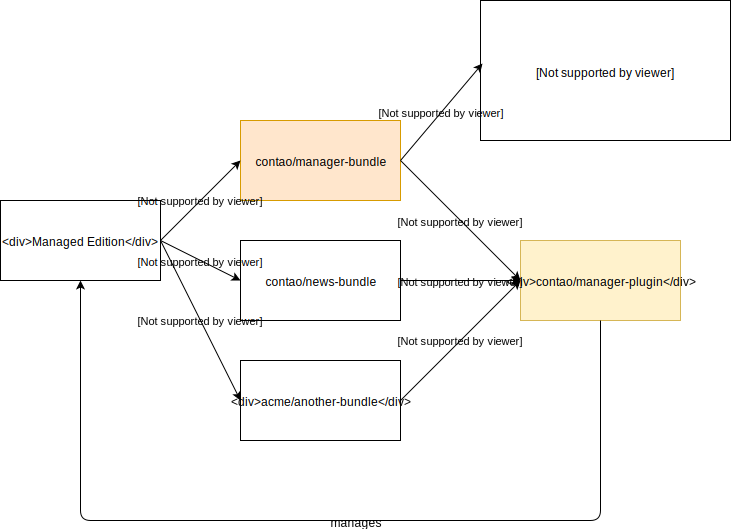

Contao is available as a so-called `Managed Edition`. Compared to a regular Symfony application, a Managed Edition
 allows automatic configuration by third-party bundles.
If you are familiar with Symfony Flex you might find some similarities but the Managed Edition was actually a thing
before Symfony Flex even existed!

## The Manager Plugin and the Manager Bundle

The heart of the `Managed Edition` consists of two main components:

* [The Manager Bundle (contao/manager-bundle)](https://github.com/contao/manager-bundle)
* [The Manager Plugin (contao/manager-plugin)](https://github.com/contao/manager-plugin)

The `Manager Bundle` contains the full application skeleton such as entry points, config files etc. thus giving us full
control on how the application is built during an update. Hence, if you want to install e.g. Contao 4.7, you would require
`contao/manager-bundle` in `4.7.*`.

{}
To start a new project, don't just require the `contao/manager-bundle` because you'll also need the `post-install` and
`post-update` Composer scripts to be in place. Just run `composer create-project contao/managed-edition [<directory>] [<version>]` instead.
{}

The core of the `Manager Bundle` is the special application kernel. Instead of loading e.g. bundles and routes from a
from the app specific folders it asks all the installed Composer packages (or in other words, the other Contao bundles)
for that information. It does so using the interfaces the `Manager Plugin` provides making your application fully
autoconfigurable. 

The `Manager Plugin` is a `Composer plugin` which hooks into Composer to automate tasks on every `composer install` or
`composer update` (see how similar it works to Symfony Flex?). As mentioned in the section above, it also provides all
the interfaces aka the API for other bundles to configure the `Managed Edition`.

Maybe an illustration helps you to understand how the pieces are put together:



The key of a `Managed Edition` are the following lines in your `composer.json` which you'll get automatically when you
run `composer create-project contao/managed-edition`:

```json
{
    "scripts": {
        "post-install-cmd": [
            "Contao\\ManagerBundle\\Composer\\ScriptHandler::initializeApplication"
        ],
        "post-update-cmd": [
            "Contao\\ManagerBundle\\Composer\\ScriptHandler::initializeApplication"
        ]
    }
}
```

So after every `composer update` or `composer install`, the `ScriptHandler` of the `Managed Edition` is called so it is
able to initialize the application.
Here are examples of what the `ScriptHandler` does to give you an idea about its responsibilities:

* Creating the whole application structure. Folders such as the `app` and the `web` folders with the entry points.
* It purges and rebuilds the cache
* It creates symlinks

## Do I need the Managed Edition?

It depends. If you have an existing Symfony fullstack application and you want to install Contao to provide additional
CMS functionality, probably not. You have full control about your application kernel and the configuration but it also
means you have to adjust the settings for every Contao update (or any other Contao bundle update for that matter).
If, however, you are planning to make Contao the most important part of your application (meaning most of what you're going
to do is content management) you're likely better of using the `Managed Edition`. Updates are easier because your application
autoconfigures itself via the `ManagerPlugin` instances of all the installed bundles. You can still control all of it 
through a global, application-wide `ManagerPlugin` that is loaded at the very end but it maybe requires a bit more code.

To learn more about the `ManagerPlugin` visit [its dedicated article](manager-plugin). 