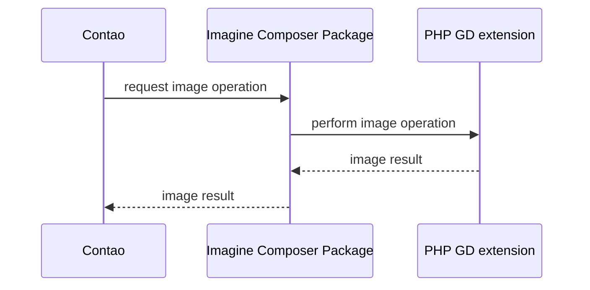
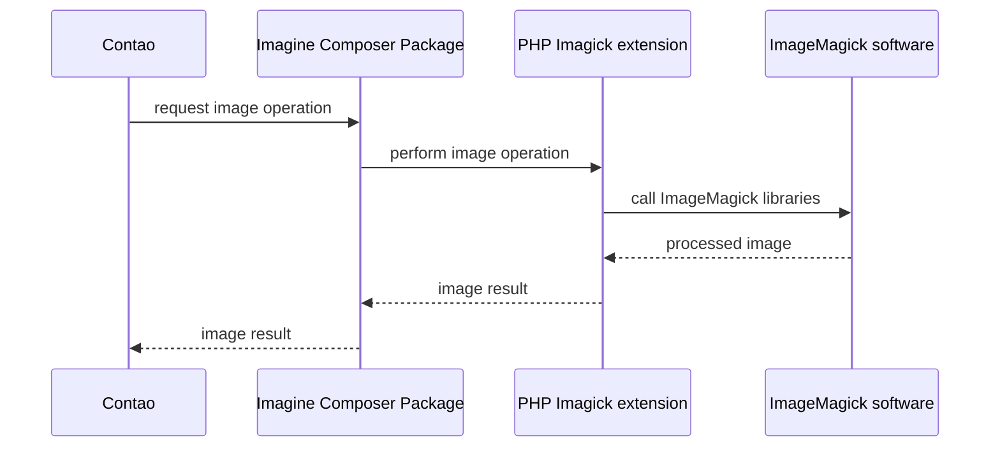
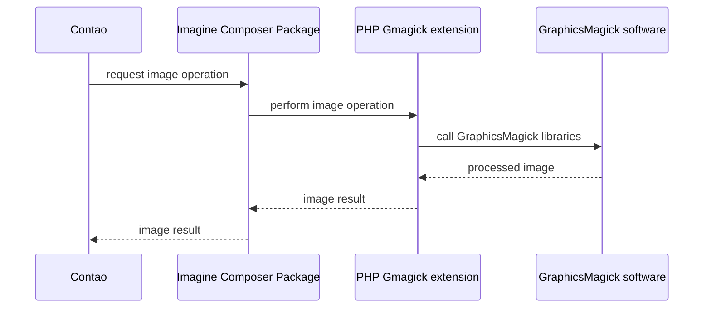

Contao features a powerful image processing system for handling image resizes and creating responsive images. In this
section you'll learn how to use this functionality in your own code and templates.

## Image Processing Stack

Under the hood, Contao uses its own standalone library [contao/image][LibraryImage] to generate responsive images. This
library is based on [imagine/imagine][LibraryImagine] and [contao/imagine-svg][LibraryImagineSvg] which do the actual
modification of image files. The `CoreBundle` comes with an `ImageFactory` and `PictureFactory` that wrap around those
libraries, adapt them to the Contao ecosystem and provide additional features like the ability to use predefined resize
configuration. Finally, there are the `Studio` classes that allow a convenient way to use the factories to generate and
output images and metadata for your templates.

| Example use case | Component | Abstraction level |
|-|-|-|
| Output images in a template | [&rarr;&nbsp;Image Studio][ImageStudio] | high |
| Resize images with full control over each parameter | [&rarr;&nbsp;ImageFactory][ImageFactory] [&rarr;&nbsp;PictureFactory][PictureFactory] | medium | 
| Use the image processing features outside a Contao application | [&rarr;&nbsp;contao/image][LibraryImage] | low to medium |
| Modify or resize images directly | [&rarr;&nbsp;imagine/imagine][LibraryImagine] [&rarr;&nbsp;contao/imagine&#8209;svg][LibraryImagineSvg] | low |

## Relationships between the image libraries

* `Imagine` is the PHP Composer package that Contao uses. It abstracts image handling for multiple libraries
* [`imagick`](https://www.php.net/manual/en/book.imagick.php), [`gmagick`](https://www.php.net/manual/en/book.gmagick.php) or [`gd`](https://www.php.net/manual/en/book.image.php) are the PHP extensions that enable image processing
* Either natively `gd` or by creating a bridge to the actual tools `ImageMagick` and `GraphicsMagic`



{}

{}

{}

{}

{}

{}



## Templating
Outputting responsive images can be quite a challenging task due its large amount of attributes and parameters. Contao
therefore provides an `image.html5` (and `picture_default.html5`) template out of the box. If you are using the Image
Studio component you can also profit from its matching `figure.html.twig` Twig template and macros.

See the [templating section][Templating] for more information.

[ImageStudio]: /framework/image-processing/image-studio/
[ImageFactory]: /framework/image-processing/image-picture-factory/#image-factory
[PictureFactory]: /framework/image-processing/image-picture-factory/#picture-factory
[LibraryImage]: https://github.com/contao/image
[LibraryImagine]: https://github.com/avalanche123/Imagine
[LibraryImagineSvg]: https://github.com/contao/imagine-svg
[Templating]: /framework/image-processing/image-studio/#templating
